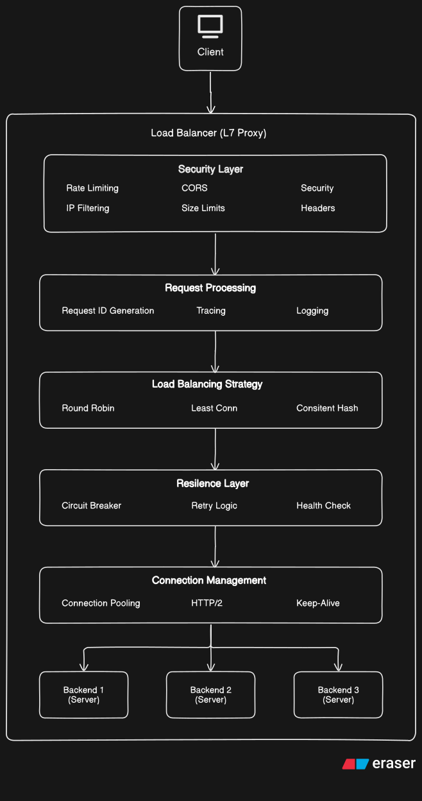

#  L7 Load Balancer
A high-performance, Layer 7 load balancer written in Go with advanced features for modern cloud-native applications. Designed for horizontal scaling, resilience, and observability.


> **Project Status: Work in Progress**  
> This project is actively under development. Core routing, routing algorithms, and connection pooling are fully functional, but APIs and configuration schemas may undergo breaking changes prior to the a stable release. 

> Features to be completed - 
>
> - Consistent hashing
> - Circuit breaker
> - Buffer Pool
> - Byte Pool
> - Retry
> - TLS


## Key Features

###  Core Load Balancing

-  **Multiple Load Balancing Strategies**: Round Robin, Least Connections, Consistent Hashing, Weighted Round Robin
-  **HTTP/2 Support**: Full HTTP/2 support with connection pooling and multiplexing
-  **Dual Engine Architecture**: Choose between `net/http` (standard) or `fasthttp` (high-performance)
-  **Zero-Downtime Config Reload**: Hot-reload configuration without service interruption


###  Resilience & Reliability

-  **Circuit Breaker Pattern**: Automatic circuit breaking with configurable thresholds
-  **Exponential Backoff Retry**: Intelligent retry logic with jitter for optimal performance
-  **Health Checks**: Active health monitoring with configurable intervals and endpoints
-  **Connection Draining**: Graceful shutdown with connection draining


###  Security

-  **TLS/SSL Termination**: Full TLS support with configurable cipher suites
-  **CORS Support**: Configurable CORS policies for cross-origin requests
-  **IP Filtering**: Whitelist/blacklist support for access control
-  **Security Headers**: Automatic injection of security headers (HSTS, CSP, X-Frame-Options, etc.)
-  **Rate Limiting**: Token-bucket rate limiting per IP with burst capacity


###  Observability

-  **Prometheus Metrics**: Comprehensive metrics including request rates, latency percentiles, error rates
-  **Distributed Tracing**: Request ID generation and propagation
-  **Structured Logging**: JSON-formatted logs with Zap for better log aggregation
-  **pprof Integration**: Built-in profiling for performance analysis


###  Performance

-  **Connection Pooling**: Optimized connection pools with keep-alive support
-  **Memory Pooling**: Object pooling to reduce GC pressure
-  **Zero-Copy Operations**: Minimized memory allocations for hot paths
-  **Benchmark Suite**: Built-in benchmarking tools for performance validation

  
  
## System Architecture




## Performance Characteristics


###  Benchmarks

Run comprehensive benchmarks using grafana k6:
```bash

k6 run --out web-dashboard test/loadtest.js

```

###  Expected Performance (fasthttp engine)

-  **Throughput**: 100,000+ RPS on modern hardware

-  **Latency**: P50 < 1ms, P95 < 5ms, P99 < 10ms

-  **Memory**: Efficient memory usage with object pooling

-  **Connections**: Supports 10,000+ concurrent connections

  
###  Scaling Capabilities

-  **Horizontal Scaling**: Stateless design enables horizontal scaling

-  **Vertical Scaling**: Efficient CPU and memory utilization

-  **Network**: Optimized for high-throughput network environments

  

##  Quick Start

  
###  Prerequisites

- Go 1.25.4 or higher
- Make (optional, for build automation)


###  Installation

```bash
git  clone  https://github.com/yourusername/load-balancer.git
cd  load-balancer
make  deps
make  build
make  run
```


###  Configuration


Create a `config.yaml` file:
```yaml

server:
  listen: ":8080"
  read_timeout: 30
  write_timeout: 30
  idle_timeout: 120
  admin_listen: ":8081"

backends:
  - url: "http://localhost:8082"
    weight: 1
  - url: "http://localhost:8083"
    weight: 1
  - url: "http://localhost:8084"
    weight: 2

health:
  interval_seconds: 10
  timeout_seconds: 5
  path: "/health"


strategy: "round_robin"   # round_robin | least_conn | consistent_hash | weighted_round_robin
fasthttp: false

rate_limit:
  rps: 120
  burst: 10


tls:
  enabled: false
  cert_file: ""
  key_file: ""
  ca_file: ""
  min_version: "TLS1.2"
  max_version: "TLS1.3"

security:
  enable_cors: true
  allowed_origins: ["*"]
  allowed_methods: ["GET", "POST", "PUT", "DELETE", "OPTIONS", "PATCH"]
  allowed_headers: ["Accept", "Authorization", "Content-Type", "X-CSRF-Token", "X-Request-ID"]
  ip_whitelist: []
  ip_blacklist: []
  max_request_size: 10485760  # 10MB
  max_response_size: 10485760 # 10MB

```

  

###  Running Backend Servers


```bash
# Start test backend servers
make  backends

# Or manually start backends

PORT=8082  SID=1  go  run  ./cmd/server  &
PORT=8083  SID=2  go  run  ./cmd/server  &
PORT=8084  SID=3  go  run  ./cmd/server  &

```


###  Starting the Load Balancer


```bash
# Start the load balancer
./build/l7-proxy

# Or use make
make  run
```

  

## Advanced Configuration


###  Load Balancing Strategies

####  Round Robin
Distributes requests evenly across all healthy backends.
```yaml

strategy: "round_robin"

```

####  Least Connections

Routes requests to the backend with the fewest active connections.
```yaml

strategy: "least_conn"

```

####  Consistent Hashing
Routes requests based on hash for session affinity.

```yaml

strategy: "consistent_hash"

```

####  Weighted Round Robin
Distributes requests based on backend weights.

```yaml

strategy: "weighted_round_robin"
backends:
- url: "http://backend1:8080"
weight: 3  # Higher weight = more requests
- url: "http://backend2:8080"
weight: 1

```


###  TLS Configuration


```yaml

tls:
enabled: true
cert_file: "/path/to/cert.pem"
key_file: "/path/to/key.pem"
ca_file: "/path/to/ca.pem"  # Optional, for client cert verification
min_version: "TLS1.2"
max_version: "TLS1.3"

```

  

###  Security Configuration

```yaml

security:
enable_cors: true
allowed_origins: ["https://example.com", "https://api.example.com"]
allowed_methods: ["GET", "POST", "PUT", "DELETE"]
allowed_headers: ["Authorization", "Content-Type"]
ip_whitelist: ["192.168.1.0/24", "10.0.0.0/8"]
ip_blacklist: ["10.0.0.50"]
max_request_size: 10485760  # 10MB
max_response_size: 10485760  # 10MB

```

  

## Monitoring & Observability

  

###  Prometheus Metrics

Access metrics at `http://localhost:8081/metrics`:

-  `proxy_requests_total`: Total requests by backend, status, and method
-  `proxy_request_duration_seconds`: Request latency percentiles
-  `proxy_active_connections`: Current active connections
-  `proxy_backend_health`: Backend health status
-  `proxy_request_size_bytes`: Request size distribution
-  `proxy_response_size_bytes`: Response size distribution
-  `proxy_errors_total`: Error counts by type


###  Health Checks


Admin server provides health information:

- Backend health status: Updated via health checks
- Circuit breaker status: Available via metrics
- Connection pool stats: Available via metrics
- 

###  Structured Logging


Logs are output in JSON format for easy parsing:

```json

{
"level":  "info",
"request_id":  "abc123",
"method":  "GET",
"path":  "/api/users",
"remote":  "192.168.1.100",
"status":  200,
"bytes":  1024,
"duration":  "5.2ms"
}

```

  

## Testing

  

###  Run Tests

```bash

go  test  ./...

```


###  Load Testing

```bash

k6 run --out web-dashboard test/loadtest.js

```

  


## Security Considerations

-  **TLS Configuration**: Always use TLS in production
-  **Network Isolation**: Deploy in private networks with proper firewalls
-  **Rate Limiting**: Configure appropriate rate limits per use case
-  **IP Filtering**: Use IP whitelisting for admin endpoints
-  **Regular Updates**: Keep dependencies updated for security patches
-  **Secrets Management**: Use secret management for TLS certificates


## Technical Highlights

###  Design Decisions

1.  **Dual Engine Architecture**: Choice between `net/http` (standard) and `fasthttp` (performance) allows flexibility based on requirements.
2.  **Circuit Breaker Pattern**: Implements the circuit breaker pattern to prevent cascading failures and improve system resilience.
3.  **Object Pooling**: Uses sync.Pool for memory optimization, reducing GC pressure and improving performance under load.
4.  **Connection Pooling**: Optimized HTTP client connection pools with keep-alive support for reduced latency.
5.  **Graceful Shutdown**: Implements connection draining to ensure in-flight requests complete during shutdown.

  
###  Performance Optimizations

-  **Zero-Copy Operations**: Minimized memory allocations in hot paths
-  **Memory Pooling**: Object reuse via sync.Pool
-  **Connection Reuse**: HTTP keep-alive and connection pooling
-  **Efficient Logging**: Structured logging with sampling for high throughput
-  **Prometheus Optimization**: Optimized metric collection with buckets


##  Contributing

Contributions are welcome! Please follow these guidelines:

1. Fork the repository
2. Create a feature branch (`git checkout -b feature/amazing-feature`)
3. Commit your changes (`git commit -m 'Add amazing feature'`)
4. Push to the branch (`git push origin feature/amazing-feature`)
5. Open a Pull Request

  
###  Development Guidelines

- Follow Go best practices and idiomatic code
- Write tests for new features
- Update documentation as needed
- Ensure all tests pass before submitting PR
- Use meaningful commit messages

**Built with ❤️ for high-performance, production-grade load balancing**